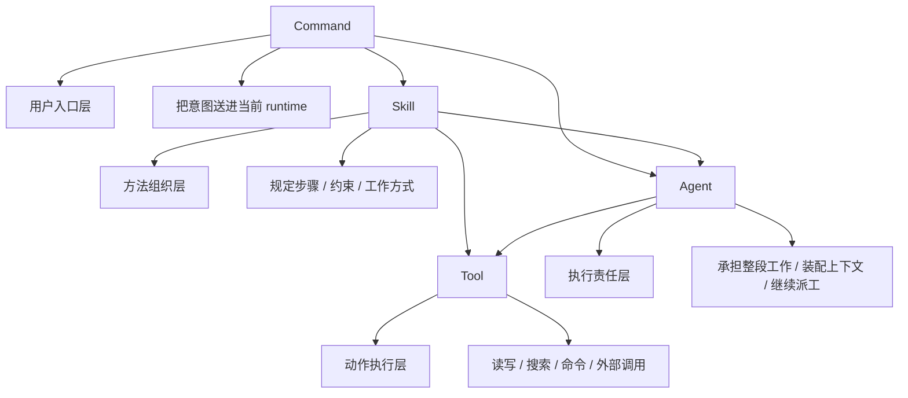

# 卷七 06｜command、tool、skill、agent 的边界为什么最终要在卷七收口

## 导读

- **所属卷**：卷七：命令、工作流与产品层整合
- **卷内位置**：06 / 08
- **上一篇**：[卷七 05｜工作流控制层是怎样在 Claude Code 里成立的](./05-how-the-workflow-control-layer-forms-in-claude-code.md)
- **下一篇**：[卷七 07｜为什么 Claude Code 的产品形态本质上是 runtime 被包装给用户的方式](./07-why-claude-codes-product-form-is-runtime-packaged-for-users.md)

第 05 篇已经把 workflow control layer 立住了。

第 06 篇接着要解决的，是卷七的边界总收口：

> **为什么 command、tool、skill、agent 的边界，必须站在控制层视角，最终在卷七统一收口？**

这篇只负责从控制层视角重排四者职责，不提前展开产品形态正文。

## 这篇要回答的问题

到卷七这里，如果还沿用前面几卷各自的局部视角去看 Claude Code，很容易得到四句都对、但拼不成系统的话：

- command 是用户入口；
- tool 是执行动作；
- skill 是方法组织；
- agent 是执行者结构。

这四句话本身没错。

问题在于，卷七第 05 篇已经把另一件事立起来了：Claude Code 不只是在堆入口、对象和执行者，它还长出了一层 workflow control layer。

一旦这层成立，再看前面四个对象，就不能只按各自卷里的局部职责来理解了。读者接下来会自然追问：

- command 既然是入口，它和 skill 的关系到底在哪里切？
- tool 看起来也是 command 能调的东西，它和 command 又怎么切？
- skill 会调 tool，也会触发 agent，它到底站在哪层？
- agent 既然名字里常常也带 tool，为什么它又不是 tool？

所以本篇真正要回答的是：

> **为什么 command、tool、skill、agent 的边界，必须站在控制层视角，最终在卷七统一收口？**

## 这篇不展开什么

按卷七卡片，这篇只做边界总收口，不提前写 07 / 08 的产品形态正文。

因此本篇不展开：

- Claude Code 今天的产品外形为什么会长成这样；
- runtime 被包装给用户的方式；
- 卷七总收束的产品判断。

本篇只做一件事：**把 command、tool、skill、agent 从控制层视角重新分层。**

## 旧文与源码锚点

### 旧文素材锚点
- `docs/guidebookv2/volume-5/08-boundaries-between-skill-tool-and-agent.md`
- `docs/guidebookv2/volume-5/18-boundaries-and-coordination-between-agent-skill-and-tool.md`
- `docs/guidebook/volume-1/20-processpromptslashcommand.md`

### 补充素材锚点
- `docs/guidebook/volume-1/31-prompt-as-instruction-layer.md`
- `docs/guidebookv2/volume-3/10-why-execution-layer-does-not-only-handle-local-tools.md`
- `docs/guidebookv2/volume-5/12-why-agent-is-not-just-another-tool.md`
- `docs/guidebookv2/volume-5/14-why-runagent-feels-like-an-agent-runtime-assembly-line.md`

### 源码锚点
- `cc/src/commands/`
- `cc/src/tools/`
- `cc/src/skills/`
- `cc/src/tools/AgentTool/`

> 说明：当前仓库不直接携带 `cc/src/*` 源树，本篇沿用卷一、卷三、卷五旧稿中已核对过的源码链与函数职责，作为证据抓手。

### 主证据链
卷三、卷五、卷六分别把动作对象、方法对象和执行者对象立起来了 → 但到了卷七，系统又已经明确长出了用户入口与 workflow control layer → 于是 command、tool、skill、agent 就不能继续只按“对象长相”来分，而必须按控制层里的职责重切：谁负责把意图送进来，谁负责把动作落下去，谁负责把动作组织成可复用方法，谁负责承担整段工作并继续分叉 → 因而这四者的边界必须在卷七统一收口。

## mermaid 主图：command / tool / skill / agent 边界总图

这张图最想保住的不是箭头多少，而是四层职责：

> **command 管入口，tool 管动作，skill 管方法，agent 管执行责任。**

## 先给结论

### 结论一：卷五能把 tool / skill / agent 三者切开，但只有卷七能把 command 一起纳入同一张控制图

卷五第 08、18 篇已经把三者边界切得很清楚：

- tool 负责动作执行；
- skill 负责方法组织；
- agent 负责执行者结构。

但那时还缺一个东西：**用户入口层**。

没有 command 这一层时，读者看到的是对象谱系：

- runtime 里有哪些动作对象；
- 有哪些方法对象；
- 有哪些执行者对象。

一旦卷七前半段把 command 和 runtime interface 立起来，问题就变了。

因为系统不再只是“有哪些对象”，而是要回答：

- 用户的意图到底先从哪里进入；
- 进入后怎样被组织成方法；
- 再怎样落成动作；
- 最后又由谁承担整段工作。

所以 command 必须加入总图，而四者边界也只能在卷七一起收口。

### 结论二：这四者的边界，不该按“是不是能做事”切，而该按“在控制链里负责哪种职责”切

这是本篇最重要的判断。

如果只按“是不是能做事”来切，这四者会越看越糊：

- command 当然也能触发事情；
- tool 更直接能做事；
- skill 会组织一整段做事流程；
- agent 甚至能独立完成一整段工作。

于是它们看起来都像“某种能力单元”。

但一旦站到控制层视角，边界就会清楚很多：

- **command** 解决的是：用户怎样把意图送进 runtime；
- **tool** 解决的是：runtime 现在能直接落什么动作；
- **skill** 解决的是：这些动作该怎么被编排成稳定方法；
- **agent** 解决的是：这段工作由谁承担，是否继续分叉，结果怎样回流。

这不是按“都能做什么”切，而是按“分别控制哪种职责”切。

### 结论三：卷七之所以必须收口，是因为 control layer 已经让四者开始互相贴边

在前面几卷里，四者还能各自占一个相对清楚的局部角度：

- 卷三偏动作；
- 卷五偏方法和扩展对象；
- 卷六偏执行者与协作。

但卷七一旦把 command 和 control layer 放进来，四者之间就开始天然贴边：

- command 往下会直接接到 skill 或 agent；
- skill 往下会调 tool，往上也可能触发 agent；
- agent 本身会带着工具池工作；
- command 里的一些控制命令，本身又在重新安排 skill / agent / tool 的使用方式。

如果这时不统一收口，读者就会只看到大量交叉，而看不见新的分层原则。

## 第一部分：为什么卷五的边界，到卷七必须重切一次

### 1. 卷五切的是对象边界，卷七切的是控制职责边界

卷五第 08 篇的判断非常稳：

> tool 是动作执行层，skill 是方法组织层，agent 是执行者结构层。

第 18 篇又从执行者侧重切了一遍：

- tool 负责把动作做下去；
- skill 负责把动作组织成方法；
- agent 负责把一段工作交给谁承担。

这些判断都成立。

但它们仍主要站在“对象是什么”来切。

卷七不一样。卷七要回答的是：

- 控制层怎样成立；
- 用户入口怎样接进来；
- workflow 怎样被正式控制。

一旦问题变成这样，原来的对象边界就需要继续被压进控制职责边界。

### 2. 旧边界不够，不是因为旧边界错了，而是因为少了 command 这一层

前面之所以还能只切 tool / skill / agent，是因为那时还没有把 command 当成正式用户入口来单独立住。

但卷七前 02、03、04 篇之后，读者已经知道：

- command 不是快捷方式；
- command 会继续接进 runtime；
- frontmatter / interface 也会进入运行语义。

这时如果还不把 command 放进总图，整套系统就会少掉“用户怎样进来”的那一层。

少了这一层，边界图还是不完整。

## 第二部分：从控制层视角看，四者各自到底负责什么

### 1. command：负责把用户意图送进控制链

卷一第 20 篇已经说明，`processPromptSlashCommand(...)` 并不是简单的 prompt 拼接器，而是 inline 路径的展开层：

- 找 command；
- 读取 `getPromptForCommand(...)`；
- 注册 hooks；
- 记录 invoked skill；
- 生成结构化 messages；
- 把权限、模型等运行元数据一起带出去。

这说明 command 的核心不是“替别人做动作”，而是：

> **把用户当前想做的事，翻译成 runtime 当前能接住的一次正式进入。**

所以 command 的边界应该切在入口层，而不是执行层。

### 2. tool：负责把动作真正落到世界上

卷三已经讲得很清楚：tool 的完成单位通常是一次动作。

它关心的是：

- 输入是什么；
- 执行什么；
- 返回什么结果。

不管是 Bash、Read、Edit，还是更高阶的工具对象，只要它主要回答的是“现在能落下什么动作”，它就站在动作执行层。

所以 tool 的边界应该切在动作层，而不是方法层或责任层。

### 3. skill：负责把动作组织成稳定工作方法

卷五第 08 篇最值的一点，是把 skill 定义成中间层：

- skill 会向下碰到 tool；
- skill 也可能向上碰到 agent；
- 但它自己始终不是动作原语，也不是执行者本体。

再结合卷七第 04、05 篇，现在可以把它说得更准一点：

> **skill 是控制层里的方法模块。**

它真正控制的是：

- 这类任务按什么步骤做；
- 哪些约束先立；
- 什么时候该查，什么时候该改，什么时候该验证；
- 必要时是否应该 fork 给 agent。

所以 skill 的边界应该切在方法组织层。

### 4. agent：负责承担整段工作并维持执行责任

卷一第 31 篇和卷五 agent 组都已经说明，AgentTool 与 `runAgent.ts` 真正在装配的是：

- 上下文；
- 工具池；
- hooks；
- MCP；
- transcript；
- 分叉 worker 与结果回流。

这说明 agent 的重点从来都不是某个单一动作，也不是一套方法说明，而是：

> **谁来承担这段工作。**

更重要的是，到了卷七这里，这个判断还要再往前走一步：

- agent 不只承担工作；
- 它还承担执行责任边界；
- 也就是“谁负责继续推进这段工作回路”。

所以 agent 的边界应该切在执行责任层。

## 第三部分：四者最容易混淆的地方，为什么要在卷七一次讲清

### 1. 为什么 command 不是 tool

因为 command 解决的是入口，不是动作。

它当然可能触发某个动作，但那只是后续结果；它自己的职责是：

- 把用户意图送进系统；
- 决定这次进入走哪条命令/skill/agent 路径；
- 把展开后的内容与运行元数据注入当前主链。

也就是说，command 的结果可能是“接下来去做事”，但 command 自己不是那件事。

### 2. 为什么 skill 不是 tool

卷五已经说过，tool 直接执行，skill 组织执行。

到了卷七，这句话还可以再补一刀：

- tool 控制的是局部动作；
- skill 控制的是动作之间的关系与顺序。

skill 可以看起来“做了很多事”，但那是因为它在编排；不是因为它自己成了动作原语。

### 3. 为什么 skill 也不是 agent

这一点在卷五第 08 篇就已经非常关键：fork skill 的执行主体最终仍然是 agent runtime。

也就是说：

- skill 可以把工作包组织出来；
- 甚至可以指定 `context: fork`、指定 agent；
- 但真正拿着上下文、工具池和生命周期去承担工作的，仍然是 agent。

到了卷七，这个判断要被重新写成：

- skill 负责方法控制；
- agent 负责执行责任。

这样边界会比“一个偏轻一个偏重”清楚得多。

### 4. 为什么 agent 也不是“高级 tool”

卷五第 12、14 篇反复强调过：AgentTool 名字里虽然有 tool，但它触发的不是某个局部动作，而是一个执行体。

它会：

- 选择执行者；
- 装配工具池与上下文；
- 决定是否继续分叉；
- 回收结果。

这说明 agent 的主语不是动作，而是责任承担者。

所以 agent 虽然通过一个 tool 入口暴露出来，但它不应被误切回 tool 层。

## 第四部分：为什么说“在卷七收口”比“在卷五收口”更稳

因为卷七终于具备了四个同时成立的视角：

1. **用户入口视角**：command 不是快捷方式，而是正式入口；
2. **运行时接口视角**：frontmatter / interface 会进入运行语义；
3. **工作流控制视角**：plan / debug / verify / orchestration 已经收成 control layer；
4. **对象与执行者视角**：tool / skill / agent 各自已有旧卷基础。

只有四个视角一起到位，command、tool、skill、agent 的边界图才真正完整。

换句话说，卷五能切清其中三者，卷七才能把四者放回同一张控制层总图里。

## 第五部分：这篇怎样为 07 / 08 留坡度

到这里，卷七中段已经做完两件最关键的事：

- 第 05 篇立住 workflow control layer；
- 第 06 篇把 command / tool / skill / agent 压回控制层边界图。

那接下来进入 07 / 08 时，问题就不再是：

- command 是什么；
- tool 是什么；
- skill 是什么；
- agent 是什么。

而会变成更上层的一问：

> **当用户入口、方法组织、动作执行和执行责任这些层都已经被 runtime 收好时，Claude Code 为什么最终会以今天这种产品形态暴露给用户？**

也就是说，第 06 篇完成的不是名词解释，而是为产品形态判断清场。

## 最后收一下

为什么 command、tool、skill、agent 的边界必须在卷七收口？

因为到了卷七，Claude Code 已经不只是几个对象并列存在，而是同时拥有：

- 正式用户入口；
- 运行时接口；
- workflow control layer；
- 执行动作、方法模块与执行者结构。

这时如果还按旧卷里的局部角度分别理解它们，读者只会看到交叉，不会看到系统。

只有站到控制层视角，边界才会重新变清楚：

- **command** 负责把意图送进 runtime；
- **tool** 负责把动作真正落下去；
- **skill** 负责把动作组织成可复用方法；
- **agent** 负责承担整段工作并维持执行责任。

所以本篇最稳的结论是：

> **command、tool、skill、agent 的边界之所以要在卷七收口，不是因为前面的边界判断失效了，而是因为当控制层成立后，这四者终于可以不再按对象长相被理解，而能按“入口、动作、方法、责任”这四种控制职责被重新分层；只有这样，Claude Code 才会从一组看似互相重叠的对象，重新显成一个有入口、有执行、有方法、有责任分层的完整系统。**
