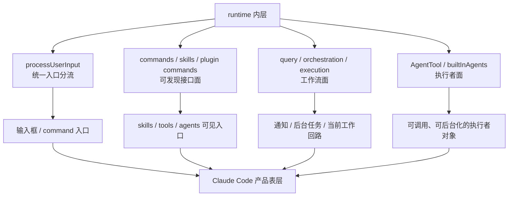

# 卷七 07｜为什么说 Claude Code 的产品形态，本质上是 runtime 被包装给用户的方式

## 导读

- **所属卷**：卷七：命令、工作流与产品层整合
- **卷内位置**：07 / 08
- **上一篇**：[卷七 06｜为什么 command、tool、skill、agent 的边界要在卷七收口](./06-why-command-tool-skill-and-agent-boundaries-close-in-volume-7.md)
- **下一篇**：[卷七 08｜为什么用户入口、运行时接口和工作流控制会收成今天这个产品](./08-why-user-entry-runtime-interface-and-workflow-control-become-todays-product.md)

第 06 篇已经把入口、执行、方法和执行责任的边界重新切开了。

第 07 篇现在要再往上推一步：

> **为什么 Claude Code 会长成今天这个产品形态，而且这个产品形态本质上不是 runtime 外面再套一层 UI，而是 runtime 被重新组织后暴露给用户的方式？**

这篇只负责解释“包装”到底包装了什么，不提前写卷尾总收束。

## 这篇要回答的问题

到卷七第 06 篇为止，入口、接口、工作流控制和执行责任已经都各自立住了：

- 用户不是直接碰 runtime 内核，而是先经由 command / prompt entry 进入；
- skill frontmatter、plugin command、built-in agent 列表这些声明，不是注释，而会进入运行时装配；
- tool orchestration、permission、stop hooks 这些结构，说明系统不仅会执行，还会控制执行；
- agent 不是“又一个 tool”，而是被正式装配出来的执行责任承担者。

这时自然会冒出下一问：

> **既然 Claude Code 内部已经有一套 runtime，为什么用户看到的不是一堆裸露的运行时对象，而是今天这种“输入框 + commands + skills + tools + agents + notifications”的产品面？**

这篇的回答必须比“因为产品化更好用”更硬。

按写作卡片，这篇真正要回答的是：

> **为什么 Claude Code 会长成今天这个产品形态，而且这个产品形态本质上不是 runtime 外面再套一层 UI，而是 runtime 被重新组织后暴露给用户的方式。**

## 这篇不展开什么

这篇只回答产品形态为什么成立，不提前写卷尾总收束。

因此本篇不展开：

- 第 08 篇那种把“用户入口 + runtime interface + workflow control layer”压回一张总图的卷尾收束；
- 全书式总结；
- 产品愿景文或营销文。

本篇只抓一件事：**“包装”到底包装了什么。**

## 旧文与源码锚点

### 旧文素材锚点
- `docs/guidebookv2/volume-6/07-why-claude-code-team-is-a-swarm.md`
- `docs/guidebookv2/volume-5/25-why-these-extension-objects-converge-into-a-platform-layer.md`
- `docs/guidebook/volume-4/15-plugin-conclusion.md`

### 必读源码文件（绝对路径）
- `/Users/haha/.openclaw/workspace/cc/src/utils/processUserInput/processUserInput.ts`
- `/Users/haha/.openclaw/workspace/cc/src/query.ts`
- `/Users/haha/.openclaw/workspace/cc/src/skills/loadSkillsDir.ts`
- `/Users/haha/.openclaw/workspace/cc/src/services/tools/toolExecution.ts`
- `/Users/haha/.openclaw/workspace/cc/src/services/tools/toolOrchestration.ts`
- `/Users/haha/.openclaw/workspace/cc/src/tools/AgentTool/AgentTool.tsx`
- `/Users/haha/.openclaw/workspace/cc/src/tools/AgentTool/prompt.ts`
- `/Users/haha/.openclaw/workspace/cc/src/tools/AgentTool/builtInAgents.ts`
- `/Users/haha/.openclaw/workspace/cc/src/utils/plugins/loadPluginCommands.ts`
- `/Users/haha/.openclaw/workspace/cc/src/commands.ts`
- `/Users/haha/.openclaw/workspace/cc/src/tools.ts`

### 主证据链
`/Users/haha/.openclaw/workspace/cc/src/utils/processUserInput/processUserInput.ts` 先把用户输入分流成 prompt / slash / bash 三类进入方式 → `/Users/haha/.openclaw/workspace/cc/src/commands.ts`、`/Users/haha/.openclaw/workspace/cc/src/skills/loadSkillsDir.ts`、`/Users/haha/.openclaw/workspace/cc/src/utils/plugins/loadPluginCommands.ts` 再把 skills、plugin commands、built-in commands 组织成可发现入口面 → `/Users/haha/.openclaw/workspace/cc/src/query.ts` 与 `/Users/haha/.openclaw/workspace/cc/src/services/tools/toolOrchestration.ts`、`/Users/haha/.openclaw/workspace/cc/src/services/tools/toolExecution.ts` 把工具执行、权限、回流做成稳定工作流面 → `/Users/haha/.openclaw/workspace/cc/src/tools/AgentTool/prompt.ts`、`/Users/haha/.openclaw/workspace/cc/src/tools/AgentTool/builtInAgents.ts`、`/Users/haha/.openclaw/workspace/cc/src/tools/AgentTool/AgentTool.tsx` 再把执行者能力做成可调用、可解释、可后台化的产品面 → 所以用户看到的 Claude Code，不是 runtime 外挂 UI，而是 runtime 被重新打包后的暴露方式。

## mermaid 主图：runtime 被包装成产品面的主图

```mermaid
flowchart TD
    A[用户输入面
文本 / slash / pasted context] --> B[/Users/haha/.openclaw/workspace/cc/src/utils/processUserInput/processUserInput.ts]

    B --> C[入口面
commands / skills / plugin commands]
    C --> C1[/Users/haha/.openclaw/workspace/cc/src/commands.ts]
    C --> C2[/Users/haha/.openclaw/workspace/cc/src/skills/loadSkillsDir.ts]
    C --> C3[/Users/haha/.openclaw/workspace/cc/src/utils/plugins/loadPluginCommands.ts]

    B --> D[turn runtime]
    D --> D1[/Users/haha/.openclaw/workspace/cc/src/query.ts]
    D --> D2[/Users/haha/.openclaw/workspace/cc/src/services/tools/toolOrchestration.ts]
    D --> D3[/Users/haha/.openclaw/workspace/cc/src/services/tools/toolExecution.ts]

    D --> E[agent 面]
    E --> E1[/Users/haha/.openclaw/workspace/cc/src/tools/AgentTool/prompt.ts]
    E --> E2[/Users/haha/.openclaw/workspace/cc/src/tools/AgentTool/builtInAgents.ts]
    E --> E3[/Users/haha/.openclaw/workspace/cc/src/tools/AgentTool/AgentTool.tsx]

    C --> F[产品入口]
    D --> G[产品工作流]
    E --> H[产品执行者]

    F --> I[Claude Code 今天的产品形态]
    G --> I
    H --> I
```

这张图要压住的判断是：

> **Claude Code 的产品面，不是把 runtime 藏起来，而是把 runtime 里最关键的入口、接口、工作流和执行者，收成用户能直接操作的一张面。**

## 补图：runtime 内层怎样映到产品表层



这张补图要压住的判断是：Claude Code 的产品面不是把 runtime 藏起来，而是把 runtime 里最关键的几层**重新整理成用户能直接操作的一张面**。

## 先给结论

### 结论一：Claude Code 的产品形态，不是“功能集合的 UI 壳”，而是 runtime 的四个面被同时暴露了出来

如果今天看到 Claude Code，只把它理解成：

- 一个输入框；
- 几个 slash commands；
- 一堆 tools；
- 一个能派 agent 的入口；

那会低估它。

源码更支持另一种说法：Claude Code 的产品面，至少同时暴露了四个 runtime 面：

1. **入口面**：用户怎样把意图送进系统；
2. **接口面**：哪些 skill / command / plugin / agent 能被发现与匹配；
3. **工作流面**：一次 turn 怎样执行、等待工具、继续下一轮、接收通知；
4. **执行者面**：什么时候还是主线程，什么时候切给 agent，什么时候转后台。

所以它不是“把很多能力摆到界面上”，而是把 runtime 的四个面一起做成了产品。

### 结论二：所谓“包装”，不是美化，而是把 runtime 的内部责任重新整理成用户可操作的入口、面板与回路

“包装”这个词很容易写空。

本篇要说的包装，不是配色、不是按钮、不是 marketing copy，而是三件更硬的事：

- 把原本分散在运行时里的入口整理成用户可触发的 command / skill 面；
- 把原本只属于 query loop 的执行回路，整理成用户能感知的 turn / tool / task / notification 面；
- 把原本属于内部装配链的 agent 能力，整理成用户可以直接委派、后台运行、续聊的执行者面。

也就是说，包装真正包装的是**运行时责任的分布方式**。

### 结论三：Claude Code 长成今天这样，是因为它的 runtime 早就不是单一聊天内核，而是一套要被人“操作”的系统

如果底层只有一次性问答模型调用，那产品面只需要一个输入框。

但 Claude Code 的源码已经不是这个结构：

- `processUserInput.ts` 在分流不同进入路径；
- `commands.ts` 在汇总来自 built-in、skill dir、plugin、workflow 的命令入口；
- `loadSkillsDir.ts` 与 `loadPluginCommands.ts` 在持续发现和装配方法接口；
- `query.ts` 在维护多轮 turn、工具结果、attachment、queued notification；
- `toolOrchestration.ts` / `toolExecution.ts` 在区分并发安全、权限、hook、tool_result 回流；
- `AgentTool.tsx` 在处理前台、后台、worktree、remote、resume、notification。

只要底层已经是这种 runtime，产品面就不会停在“聊天 UI”，它必然会朝“可操作运行系统”收束。

## 第一部分：产品面先包装的是用户入口，而不是功能按钮

### 1. `/Users/haha/.openclaw/workspace/cc/src/utils/processUserInput/processUserInput.ts` 说明用户面对的第一个产品层，其实是入口分流层

这个文件最值钱的地方，不是“处理输入”这四个字，而是它把用户可能给出的东西做了正式分流：

- 普通 prompt 走文本路径；
- slash command 走 `processSlashCommand(...)`；
- bash mode 走 `processBashCommand(...)`；
- 图片、attachment、hook additional context 也会在这里进入。

这说明用户看到的输入框，根本不是单一文本框，而是**runtime 的统一入口代理**。

产品上看它像一个输入面；源码上看它其实在帮用户选择进入哪条运行链。

### 2. `/Users/haha/.openclaw/workspace/cc/src/commands.ts` 说明产品入口不是手写菜单，而是运行时装配出来的入口面

`commands.ts` 里的 `loadAllCommands(...)` 很关键。它不是手工列一个固定菜单，而是把：

- `getSkillDirCommands(cwd)`；
- `getPluginSkills()`；
- `getPluginCommands()`；
- `getWorkflowCommands(cwd)`；
- `COMMANDS()` built-ins；

一起汇总起来。

这意味着产品里的 command 面并不是“前端列按钮”，而是**运行时把可供进入的能力面装配出来**。

这和普通产品里的 command palette 非常不一样。普通 palette 是 UI 索引；这里的 palette 背后是 runtime 入口注册表。

### 3. `/Users/haha/.openclaw/workspace/cc/src/skills/loadSkillsDir.ts` 与 `/Users/haha/.openclaw/workspace/cc/src/utils/plugins/loadPluginCommands.ts` 说明接口面也被直接包装成产品入口

这两个文件一起看，会发现 Claude Code 并没有把 skill / plugin 当成“安装后内部自用的配置”。

- `loadSkillsDir.ts` 里 `getSkillDirCommands(...)` 会从 managed / user / project / additional dirs 装配 skills；
- `loadPluginCommands.ts` 里 `getPluginCommands()` 与 `getPluginSkills()` 会把 enabled plugins 中的 commands 与 skills 全部转成正式 `Command` 对象；
- 这些对象又都会带 `description`、`allowedTools`、`whenToUse`、`model`、`effort`、`userInvocable` 等运行字段。

所以用户看到的并不是一堆静态功能，而是**runtime interface 被做成了产品入口面**。

## 第二部分：产品面第二层包装的，是 query loop 这种内部主链

### 1. `/Users/haha/.openclaw/workspace/cc/src/query.ts` 暴露出 Claude Code 的产品核心不是消息列表，而是 turn runtime

`query.ts` 不是聊天渲染文件，而是一条真正的运行主链：

- `prependUserContext(...)` / `appendSystemContext(...)` 先装配上下文；
- `deps.callModel(...)` 发起本轮模型调用；
- 收到 `tool_use` 后进入 `runTools(...)`；
- 再把 `tool_result`、attachment、queued notifications 推回下一轮；
- 最后靠 stop hooks、token budget、max turns 决定是否继续。

也就是说，用户表面上看到的是一轮轮对话，底层其实是一个**可递归继续的 turn machine**。

Claude Code 的产品感，恰恰来自它没有把这个主链完全藏掉。用户会直接感受到：

- 现在是继续一轮；
- 现在卡在工具；
- 现在有后台通知回来；
- 现在工具结果又进入下一轮了。

### 2. 明确函数链：从输入到工具回路的产品主链

这篇至少要压出一条真实链。最稳的一条是：

`/Users/haha/.openclaw/workspace/cc/src/utils/processUserInput/processUserInput.ts` 的 `processUserInput(...)`
→ `/Users/haha/.openclaw/workspace/cc/src/QueryEngine.ts` / `handlePromptSubmit` 把处理结果并入 turn
→ `/Users/haha/.openclaw/workspace/cc/src/query.ts` 的 `query(...)`
→ 在流式 assistant message 中收集 `tool_use`
→ `/Users/haha/.openclaw/workspace/cc/src/services/tools/toolOrchestration.ts` 的 `runTools(...)`
→ `/Users/haha/.openclaw/workspace/cc/src/services/tools/toolExecution.ts` 的 `runToolUse(...)` 与 `checkPermissionsAndCallTool(...)`
→ 产出 `tool_result`
→ 回到 `query.ts` 进入下一轮。

这条链说明的不是“某个工具如何执行”，而是：

> **Claude Code 的产品工作流，就是把 runtime 的 turn 链直接做成了用户能经历的产品节奏。**

### 3. `/Users/haha/.openclaw/workspace/cc/src/services/tools/toolOrchestration.ts` 与 `/Users/haha/.openclaw/workspace/cc/src/services/tools/toolExecution.ts` 说明产品面还包装了“执行秩序”

这两个文件一起看，很容易看见 Claude Code 为什么不像简单的 tool runner。

`toolOrchestration.ts` 里的 `partitionToolCalls(...)` 会先区分 concurrency-safe 与非 concurrency-safe 的工具批次；`runTools(...)` 再决定哪些并发、哪些串行。  
`toolExecution.ts` 里则继续处理：

- input schema 校验；
- `validateInput`；
- pre-tool hooks；
- permission decision；
- 真正 `tool.call(...)`；
- post-tool hooks；
- tool_result 回写。

所以用户感受到的“Claude Code 会自己决定怎么跑工具、什么时候征求许可、什么时候并行”并不是产品经理层面的设计，而是 runtime 秩序已经被包装到了产品面上。

## 第三部分：产品面第三层包装的，是可发现的 runtime interface

### 1. `/Users/haha/.openclaw/workspace/cc/src/skills/loadSkillsDir.ts` 说明 skill 不是内部提示词仓，而是产品级可发现接口

这个文件里最关键的不只是 `createSkillCommand(...)`，而是：

- frontmatter 会被解析成 `allowedTools`、`whenToUse`、`model`、`effort`、`hooks`、`executionContext`、`agent`；
- 这些字段会进入 `Command` 对象；
- 之后被 `commands.ts` 汇总进统一入口面。

也就是说，skills 被包装给用户的方式，不是让用户去翻 markdown，而是让 skill 成为**产品入口中的一种正式接口对象**。

### 2. `/Users/haha/.openclaw/workspace/cc/src/utils/plugins/loadPluginCommands.ts` 说明 plugin 并不是躲在产品背后，而是直接塑造产品入口层

`getPluginCommands()` / `getPluginSkills()` 做的事情，本质上是把 plugin 内容编译成运行时命令对象，再送回命令系统。

这意味着 plugin 不只是扩展运行时能力，还会直接改变用户能看到的产品入口面。

所以卷五讲的“平台层”到这里才真正落地：

> **平台层并不是藏在产品后端的一层，而是会继续长到产品表面。**

## 第四部分：产品面最后包装的，是执行者系统本身

### 1. `/Users/haha/.openclaw/workspace/cc/src/tools/AgentTool/prompt.ts` 说明 agent 先被包装成“何时该用、怎么 brief”的产品对象

`prompt.ts` 很重要，因为它不是执行 agent，而是在定义 agent 怎样被用户和主 agent 理解。

它会明确：

- 哪些 agent type 可用；
- 各自 `whenToUse` 是什么；
- 什么情况下不要用 agent；
- 该怎么写 prompt；
- fork 和 fresh agent 的差异是什么。

这说明 agent 在暴露给用户之前，已经先被包装成**可解释、可选择、可正确调用的产品对象**。

### 2. `/Users/haha/.openclaw/workspace/cc/src/tools/AgentTool/builtInAgents.ts` 说明产品并不是只有一个“万能 agent”，而是把不同执行责任做成了产品化角色面

`getBuiltInAgents()` 里至少能看到：

- `GENERAL_PURPOSE_AGENT`；
- `STATUSLINE_SETUP_AGENT`；
- 某些场景下还有 `EXPLORE_AGENT`、`PLAN_AGENT`、`VERIFICATION_AGENT`；
- 非 SDK 入口还会有 `CLAUDE_CODE_GUIDE_AGENT`。

这说明 Claude Code 的产品面不是“一个聊天助手 + 隐藏内部 worker”，而是**把不同执行责任直接塑成角色化产品面**。

### 3. `/Users/haha/.openclaw/workspace/cc/src/tools/AgentTool/AgentTool.tsx` 说明 agent 能力已经被包装成完整产品动作，而不是内部 API

这个文件最能说明“runtime 被包装给用户”。

它不仅会：

- 选 agent type；
- 查 required MCP servers；
- 处理 sync / async；
- 处理 `run_in_background`；
- 处理 `isolation: "worktree" | "remote"`；
- 处理 `SendMessage` 续聊；
- 处理 completion notification；
- 处理 background task 注册和 output file。

这里最硬的一条调用链是：

`/Users/haha/.openclaw/workspace/cc/src/tools/AgentTool/AgentTool.tsx` 里 `AgentTool.call(...)`
→ 用 `/Users/haha/.openclaw/workspace/cc/src/tools.ts` 的 `assembleToolPool(...)` 组装 worker tool pool
→ 选择 `/Users/haha/.openclaw/workspace/cc/src/tools/AgentTool/builtInAgents.ts` 或自定义 agent definition
→ 调 `/Users/haha/.openclaw/workspace/cc/src/tools/AgentTool/runAgent.ts` 的 `runAgent(...)`
→ 结果再被包装成 `completed` / `async_launched` / `remote_launched` 等产品可见状态。

这条链已经不是“调一个 agent API”，而是：

> **把一条完整执行者装配链做成了用户可直接操作的产品动作。**

## 第五部分：所以“包装”具体包装了什么

到这里，可以把本篇最该落下的硬货说透了。

所谓“runtime 被包装给用户”，具体包装了四样东西：

### 1. 把进入 runtime 的方式包装成产品入口
- 输入框不是纯文本框；
- slash command 不是快捷键；
- skill / plugin command 不是文件仓。

### 2. 把运行时接口包装成产品可发现能力面
- skills 会变成命令；
- plugin commands 会进入统一入口；
- built-in agents 会进入可选角色列表。

### 3. 把执行回路包装成产品工作流
- turn 会继续；
- tools 会并发或串行；
- permission 会打断或放行；
- queued notification 会重新入队。

### 4. 把执行者系统包装成产品对象
- agent 可前台、后台、remote、worktree；
- 结果可通知、可续聊、可追踪；
- 执行责任不再只是内部 runtime 结构，而是产品可操作结构。

所以“包装”不是 cosmetic，而是**把 runtime 的四层责任重组成用户真的能操作的一张产品面**。

## 第六部分：为什么这不是营销判断，而是源码判断

因为这篇的判断不需要任何愿景话术，源码本身已经够了。

只看绝对路径文件就能成立：

- `/Users/haha/.openclaw/workspace/cc/src/utils/processUserInput/processUserInput.ts`：用户入口分流；
- `/Users/haha/.openclaw/workspace/cc/src/commands.ts`：入口面汇总；
- `/Users/haha/.openclaw/workspace/cc/src/skills/loadSkillsDir.ts`：方法接口装配；
- `/Users/haha/.openclaw/workspace/cc/src/utils/plugins/loadPluginCommands.ts`：平台扩展进入产品入口；
- `/Users/haha/.openclaw/workspace/cc/src/query.ts`：turn runtime；
- `/Users/haha/.openclaw/workspace/cc/src/services/tools/toolOrchestration.ts`：工具编排；
- `/Users/haha/.openclaw/workspace/cc/src/services/tools/toolExecution.ts`：权限与执行；
- `/Users/haha/.openclaw/workspace/cc/src/tools/AgentTool/prompt.ts`：agent 产品说明面；
- `/Users/haha/.openclaw/workspace/cc/src/tools/AgentTool/AgentTool.tsx`：agent 产品动作面。

这些文件加起来，已经足够说明 Claude Code 的产品不是后贴上去的。

## 这篇怎样给第 08 篇留坡度

第 07 篇在这里先停住，结论是：

> **Claude Code 今天的产品形态，本质上是 runtime 里的入口、接口、工作流和执行者能力，被重新整理并暴露给用户的方式。**

但第 08 篇还要再往前走一步：

- 第 07 篇主要解释“产品形态为什么会这样长出来”；
- 第 08 篇则要把“用户入口、runtime interface、workflow control layer”重新压回同一张产品图。

也就是说，第 07 篇先解释“为什么这像产品”，第 08 篇再解释“为什么这些层最终会闭合成今天这个产品”。

## 最后收一下

为什么说 Claude Code 的产品形态，本质上是 runtime 被包装给用户的方式？

因为用户今天看到的 Claude Code，并不是一个聊天壳外面挂了几个功能，而是 runtime 中最关键的几层已经一起被做成了产品面：

- `/Users/haha/.openclaw/workspace/cc/src/utils/processUserInput/processUserInput.ts` 把输入面做成统一入口分流；
- `/Users/haha/.openclaw/workspace/cc/src/commands.ts`、`/Users/haha/.openclaw/workspace/cc/src/skills/loadSkillsDir.ts`、`/Users/haha/.openclaw/workspace/cc/src/utils/plugins/loadPluginCommands.ts` 把 command / skill / plugin interface 收成可发现入口面；
- `/Users/haha/.openclaw/workspace/cc/src/query.ts`、`/Users/haha/.openclaw/workspace/cc/src/services/tools/toolOrchestration.ts`、`/Users/haha/.openclaw/workspace/cc/src/services/tools/toolExecution.ts` 把 turn、tool、permission、回流收成产品工作流面；
- `/Users/haha/.openclaw/workspace/cc/src/tools/AgentTool/prompt.ts`、`/Users/haha/.openclaw/workspace/cc/src/tools/AgentTool/builtInAgents.ts`、`/Users/haha/.openclaw/workspace/cc/src/tools/AgentTool/AgentTool.tsx` 又把执行者系统收成可选择、可后台化、可续聊的产品对象。

所以这篇最稳的结论是：

> **Claude Code 今天的产品形态，并不是 runtime 之外额外多出的一层包装，而是当用户入口、运行时接口、工具编排和执行者装配都已经在源码里成立之后，系统把这些内部责任重新整理成用户可直接操作的一张面；换句话说，Claude Code 的产品，本质上就是 runtime 被包装给用户的方式。**
